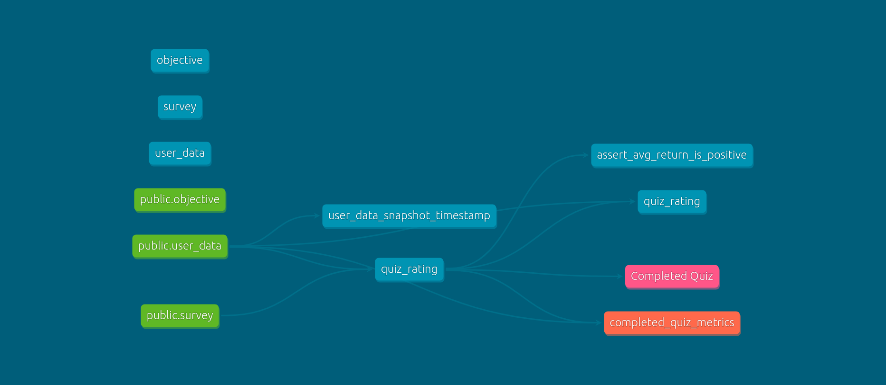

# DBT Learning Repo

## How to Run

Create and activate virtual environment
```
virtualenv env
. env/bin/activate
```

Install DBT
```
pip install dbt-postgres
```

Config your profiles.yml [Reference](https://docs.getdbt.com/dbt-cli/configure-your-profile)
```
nano /home/{your_username}/.dbt/profiles.yml
```

Run

```
dbt seed
```

```
dbt run
```

```
dbt test
```

```
dbt docs generate
dbt docs serve
```

## Data Lineage

